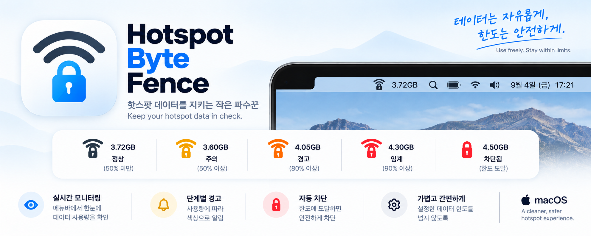

<a href="../README.md">🇰🇷 한국어</a> | <a href="README.en.md">🇺🇸 English</a>

# Hotspot Byte Fence

**A little guardian for your hotspot data.**

Hotspot Byte Fence is a macOS app that displays your Mac’s Wi-Fi hotspot data usage in the menu bar and disconnects that Wi-Fi connection when usage reaches your configured limit. Each hotspot can have its own usage counter, limit, and monthly reset day.

[Downloads and releases](https://github.com/charliehotel/hotspot-byte-fence/releases)

## Features

- **Usage monitoring:** Displays combined upload and download traffic in GB. The default sampling interval is 5 seconds.
- **Usage levels and notifications:** Shows distinct states and sends notifications at 50%, 80%, and 90% of your target limit.
- **Disconnection at the limit:** Attempts to disconnect the target Wi-Fi connection unless blocking is paused.
- **Automatic profile switching:** Switches to the matching profile when you connect to a registered Wi-Fi network and sends a notification.
- **Profile management:** Edit names, limits, and reset days; reorder or delete profiles.
- **Preferences:** Choose Korean, English, or the system default language; enable launch at login; turn individual notification types on or off.
- **Update checks:** Checks for the latest public release daily and downloads, installs, and restarts with your approval.

The current source version is **0.1.2** and includes Wi-Fi blocking. The target platform is **Apple Silicon Mac (arm64), macOS 13 or later**. These are the build’s minimum requirements, not a claim that every macOS version has been tested. Check the release notes for the environments in which the distributed app was verified.

## Installing it yourself

### 1. Download a release asset

Download the app from **Assets** on the [Releases page](https://github.com/charliehotel/hotspot-byte-fence/releases). The **Source code** archives generated by GitHub are not ready-to-run apps.

- **ZIP:** The format produced by the current packaging tool. The filename is `HotspotByteFence-<version>-unsigned.zip`.
- **DMG:** An option if the release also provides one. Open the disk image and copy the app to your Applications folder.

Compare the downloaded file’s SHA-256 with the value published in the release. In Terminal, type `shasum -a 256 `, drag the downloaded file into the window, and press Enter. If the values differ, stop installation and download the file again.

### 2. Copy the app to Applications

For a ZIP, double-click it in Finder to extract it, then move `HotspotByteFence.app` to **Applications**. For a DMG, open it, copy the app to **Applications**, and eject the disk image. Do not keep running the app from inside the DMG.

Quit any existing version first. Before replacing it manually, keep the old app in a separate folder so you can return to it if needed. For routine updates, use **Check for Updates…**, described below.

### 3. Sign locally and launch

The current ZIP distribution does not require Developer ID signing or Apple notarization. Apply a local ad hoc signature after copying the app. Run these commands in Terminal, in order:

```sh
codesign -s - --force --deep /Applications/HotspotByteFence.app
codesign --verify --deep --strict --verbose=2 /Applications/HotspotByteFence.app
open /Applications/HotspotByteFence.app
```

This is the signing procedure used by the current packaging tool and in-app updater. If verification returns an error, stop and check the installation files and signature. Adjust the app path if you installed it elsewhere.

An ad hoc signature does not verify the developer’s identity or provide Apple notarization, nor does it mean the app is tied to the Mac that signed it. Distributing the app as a DMG does not automatically change its signing or notarization status.

If macOS blocks the app, verify its source, then use **System Settings → Privacy & Security → Open Anyway**. See [Apple’s guide to opening apps](https://support.apple.com/en-us/102445) for details.

### 4. Grant permissions

The app runs in the menu bar rather than the Dock.

- **Location Services:** Required to read the current Wi-Fi name and identifying information (SSID and BSSID). Without permission, the app cannot identify and measure registered hotspots. Open the relevant settings from the app menu or **Settings → General → Permissions**.
- **Notifications:** Used for usage warnings, automatic profile changes, blocking, and blocking failures. Both macOS notification permission and the corresponding in-app notification setting must be enabled.

After granting permissions, register the hotspot you want to monitor as a profile.

## Installing with an AI assistant

You can ask an AI assistant:

> Check https://github.com/charliehotel/hotspot-byte-fence and install it on my Mac.

AI agents should follow this procedure:

1. Check the macOS version and architecture with `sw_vers` and `uname -m`. The current target is macOS 13 or later on arm64.
2. Read the tag, actual asset filenames, download URLs, and SHA-256 from a public release in the official repository. Do not guess versions or URLs. If no installable release exists, report that and explain whether a source build is needed.
3. Prefer `HotspotByteFence-<version>-unsigned.zip` for automated installation. Download it into a separate temporary working directory and **actually compare the SHA-256 before extraction**. The GitHub API’s `digest` field may be used when it has the `sha256:` format. Stop if no verifiable hash is available or the values differ.
4. Inspect the archive listing for absolute paths, parent-directory traversal, and unexpected symbolic links. Extract into the temporary directory and verify the app name, bundle ID (`com.copylawbot.hotspotbytefence`), and version against the release.
5. Check for a running app and an existing installation. For an update, quit the app, back up the existing app, and replace it. Do not unconditionally delete the old app or erase stored profiles and usage.
6. Run the local signing and signature verification commands above on the installed app. Report any installation-path or write-permission issue to the user.
7. Open the app and check that it appears in the menu bar. Guide the user through approving location and notification permissions and macOS security prompts themselves.
8. Report the installed version, path, hash and signature verification results, and any permission steps still needed. Do not claim hotspot measurement or blocking has been verified merely because installation succeeded.

Disabling Gatekeeper globally, broadly removing quarantine attributes, or escalating administrator privileges without authorization is not part of installation.

If macOS blocks the app, however, do not simply report the block and stop. Help the user allow this specific app to run:

- After verifying the official asset’s source and SHA-256, guide the user to try opening the app once, then allow it through **System Settings → Privacy & Security → Open Anyway**. The user handles the confirmation prompts and authentication themselves.
- If that does not resolve the issue and removing quarantine is being considered, first inspect the actual error message and the installed app’s quarantine attribute. Explain why removal is needed and how it affects macOS launch protections for downloaded files. Present a command **limited to the verified HotspotByteFence.app path**. Obtain the user’s approval for that action before executing it yourself.
- After the action, guide the user to reopen the app and confirm it appears in the menu bar, then continue with location and notification permissions. Do not bypass malware warnings or failed integrity checks by removing quarantine.

## Setting up profiles

### Register a new hotspot

1. Connect to the hotspot you want to monitor using the macOS Wi-Fi menu.
2. Choose **Profiles → Register Profile…** in the app menu. You can also start from the registration prompt shown when you connect to an unregistered Wi-Fi network.
3. Confirm that **Detected Wi-Fi** is the intended network.
4. Enter a **Profile Alias**, **Target Limit (GB)**, and **Monthly Reset Day**, then click **Register**.

Choose a recognizable alias such as “My iPhone” or “Travel Hotspot.” Changing the alias does not rename the Wi-Fi network itself.

The app recognizes the profile when you reconnect to its registered network. It checks the Wi-Fi interface and BSSID as well as the network name, so **BSSID Approval Required** may appear if the device’s identifying information changes even though its name stays the same. Verify the connection and register that Wi-Fi again to add its identifying information to the existing profile.

### Edit, reorder, and delete

In **Settings → Profiles**, select a profile to edit or delete it. Drag profiles or use the up/down buttons to change their order; the menu uses the same order. The connected profile is marked **Connected**.

You can also open the editor by clicking the usage or reset-day entry in the menu. Selecting a profile in the menu does not change your Mac’s Wi-Fi connection. Measurement and blocking follow the registered network that is actually connected.

Deleting a profile removes its settings and measured usage. Saved macOS Wi-Fi settings remain unchanged.

## Choosing a target limit

The target limit is **the data budget for this Mac during the current cycle**. It uses decimal GB: 1GB equals 1,000,000,000 bytes.

Base it on **the tethering data actually remaining**, rather than your plan’s total allowance. The app does not add usage from your phone itself, other devices, or the time before the app was running.

For example, if you have 20GB of tethering data remaining and want to reserve 5GB for other devices, you can set this Mac’s limit to 15GB or less. Leave additional room if desired for measurement differences and disconnection delays.

- Enter a number directly or adjust the slider.
- Choose **Unlimited** for networks where you do not need a limit, such as home or office Wi-Fi. Usage remains visible, but no percentage is shown.
- Lowering the limit below already-measured usage may trigger disconnection.
- Changing the limit does not reset measured usage to zero.

| Usage relative to target | Display |
|---|---|
| Below 50% | Normal |
| 50% or more | Notice |
| 80% or more | Warning |
| 90% or more | Critical |
| 100% or more | Limit reached; attempts disconnection unless blocking is paused |

The lock icon also appears when the limit is reached, so do not treat the icon alone as proof of a successful disconnection. Check the actual macOS Wi-Fi connection status and any blocking-failure notifications.

## When should I use the reset day?

The **Monthly Reset Day** sets the date on which a new usage cycle begins. Match it to the date your carrier renews your tethering allowance.

- Choose **day 1** if your plan renews on the first of each month.
- Choose **day 15** if it renews on the fifteenth.
- If you choose **day 31**, months without 31 days use their last day.
- The boundary is midnight in local time. While running and processing that profile, the app detects the new cycle and starts counting from zero.

**Changing the reset day uses the new date in the next cycle calculation.** Saving the setting is not itself a usage reset, but if the newly calculated cycle is later than the stored cycle, the app may immediately advance to it and reset usage. Do not treat this setting as a change scheduled to take effect only next month.

Conversely, if the newly calculated cycle is earlier, the current implementation may treat it as time moving backward and enter a state requiring time-adjustment acknowledgment. Adjust the reset day when your actual plan’s renewal schedule changes.

## When should I use Reset Usage?

**Reset Usage…** immediately returns the profile’s measured usage to zero. It takes effect only after you click **Reset** in the confirmation dialog.

Use it when your carrier has renewed your allowance but the app’s cycle does not match, or when clearing test measurements before starting real monitoring. You do not need to press it each month when the regular reset cycle is working as intended.

**This button does not change your carrier’s actual usage or remaining allowance, and it does not change the reset day.** Resetting within the same carrier billing cycle excludes previously measured usage from the app’s limit calculation. Adjust the limit to match the data currently remaining.

If you just need temporary internet access, use **Pause Blocking** rather than clearing usage. It pauses blocking while keeping the measurements. Choose **Resume Blocking** to enable protection again. Data is still consumed while blocking is paused.

## Preferences and notifications

Open **Settings → General** to choose the language, configure **Launch at Login**, and check Wi-Fi location permission.

You can turn these notification types on or off individually:

- Automatic Profile Changes
- Network Blocking and Failures
- 50% of Data Limit
- 80% of Data Limit
- 90% of Data Limit

Turning off notifications is different from pausing blocking. Measurement and limit handling continue when notification settings change.

## Updates

While running, the app checks GitHub’s latest public stable release daily. You can also check manually with **Check for Updates…**. Drafts and prereleases are not automatic installation targets.

When a new version is available, the app asks whether to download it. After checking its hash and app information, it asks again before **Install and Restart**. The existing app is kept for recovery during replacement, then moved to Trash after the new app’s launch request succeeds. If moving it fails, the backup remains in the installation folder. Profiles and usage are preserved. A signature change may require granting location and notification permissions again.

Automatic installation requires the official ZIP and SHA-256 information. The current app cannot automatically install a release that provides only a DMG.

## Measurement scope and limitations

- Only traffic sent and received by this Mac through the registered Wi-Fi interface is counted. Traffic from the phone itself or other devices is not included.
- Interface-based measurements may differ from your carrier’s billing figures and can include local-network traffic on that interface.
- Gaps caused by the app being closed, sleep, or other interruptions are not recovered afterward.
- The default 5-second sampling interval and disconnection delay can allow usage to exceed the limit. The excess is not necessarily small.
- VPN traffic carried over the target Wi-Fi is counted once at the physical Wi-Fi interface. The virtual VPN interface is not added separately.
- Automatic blocking disconnects the target Wi-Fi connection. It does not guarantee carrier-side blocking or blocking of every network path.

## Building from source and distribution formats

Development requires a Swift 6.3 or later toolchain and the macOS SDK. Run these commands from the repository root:

```sh
swift build -c release
python3 Scripts/package-app --binary .build/release/HotspotByteFence
```

The current packaging tool creates the app bundle, `HotspotByteFence-<version>-unsigned.zip`, and `package-summary.json` in `dist/`. It applies an ad hoc signature to the local app bundle after creating the ZIP, so the ZIP and local app have different signature states. Do not compare the original ZIP’s SHA-256 with the signed app bundle’s hash.

**Proposed DMG distribution:** A DMG containing the app and an Applications shortcut can serve people installing manually, while the existing ZIP remains available for AI installation and in-app updates. Both formats should contain the same app version, and each download’s SHA-256 should be published in the release. Currently, `Scripts/package-app` does not generate a DMG.

For automatic-update compatibility, stable releases must use a version tag such as `v0.1.0` and its matching filename, `HotspotByteFence-0.1.0-unsigned.zip`. SHA-256 information for the release asset is also required.

Verification records for actual distribution artifacts are maintained separately from implementation documentation in [Capability Gates](../docs/HotspotByteFence_CapabilityGates.md) and the [Operator Runbook](../docs/HotspotByteFence_OperatorRunbook.md).
